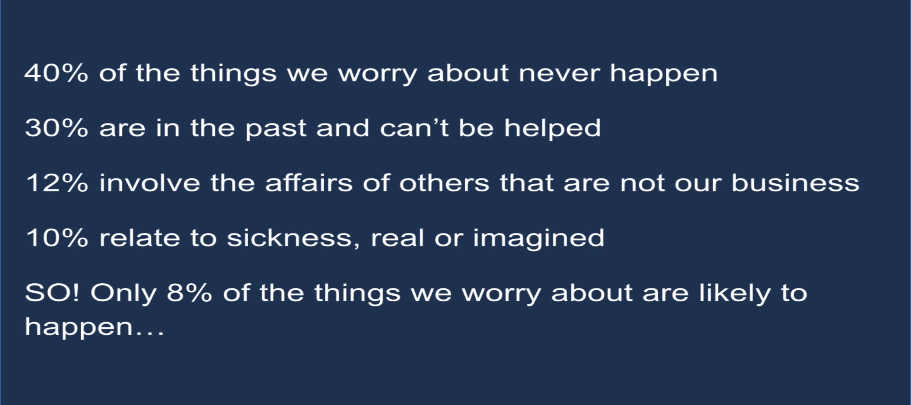

Nel momento in cui ti trovi nella situazione di dover fare una scelta importante, **hai paura**, diciamoci la verità, è così.

Chi non ha paura di prendere una decisione e poi prendere una cantonata pazzesca? 

E' normalissimo avere paura perché non si sa a cosa si va incontro ed è un campanello di allarme che ci farà riflettere sulla scelta che stiamo per fare.

## E se va male?

Quante volte avrai pensato: ***"Zi, ma è la scelta giusta?"*** prima di buttarti. 

Il punto non è tanto l'avere paura, ma bloccarsi dalla paura e fare in modo che tutti i pensieri negativi prendano il sopravvento così da avvelenare la realtà e bloccarsi.

Infatti molto spesso decidiamo di non intraprendere una strada, oppure di non prendere una decisione o di non affrontare una situazione perché **abbiamo paura** e siamo dei codardi. Temiamo quello che potrebbe succedere.

Visto che il tema mi tocca personalmente, proprio ieri sera su YouTube vedevo un video sul canale di TEDx (trovate il video alla fine dell'articolo) ed è uscita fuori una cosa **pazzesca**. 

La presentatrice ha raccontato la sua esperienza e di come le sue paure l'hanno spinta ad intraprendere strade per combatterle, strade che l'hanno cambiata molto dal punto di vista personale. 
La cosa sconcertante è il fatto che praticamente quasi tutte le nostre paure sono infondate. 

Dall'immagine infatti si capisce come solo l'8% delle cose che ci incutono paura, possono realmente accadere, tutte le altre sono: **PIPPE MENTALI!**

## Cosa ho fatto io

Fatti meno pippe mentali ed affronta una tua paura a testa alta sviluppando un progetto o affrontando una situazione, prendendo una decisione, insomma, fai qualcosa! 

Per esempio, io ho iniziato questo blog perché ho la paura di dire cazzate quando espongo le mie idee o il mio punto di vista, e per evitare di dire cazzate ed essere giudicato, sto zitto! 
Magari è così, magari queste sono solo cazzate, ma non mi interessa, almeno ci sto provando!

Vediamo come si evolveranno le cose.

Alla prossima!

 

## Un'ultima cosa zi ✋ ✋

<form action="https://sprintstudio.us11.list-manage.com/subscribe/post?u=baa6a96ac00514e2d994c55e2&amp;id=10b14f6753" method="post" id="mc-embedded-subscribe-form" name="mc-embedded-subscribe-form" class="validate" target="_blank" validate>
	<legend>Iscriviti nella Newsletter</legend>
	

		<input type="text" name="FNAME" class="form-control" id="mce-FNAME" placeholder="Il tuo Nome" required="">
	

	

		<input type="email" name="EMAIL" class="form-control required email" id="mce-EMAIL" placeholder="La tua email" required="">
	

	

		<button type="submit" class="btn btn-default" value="Iscriviti" href="">Iscriviti</button>
	

</form>

