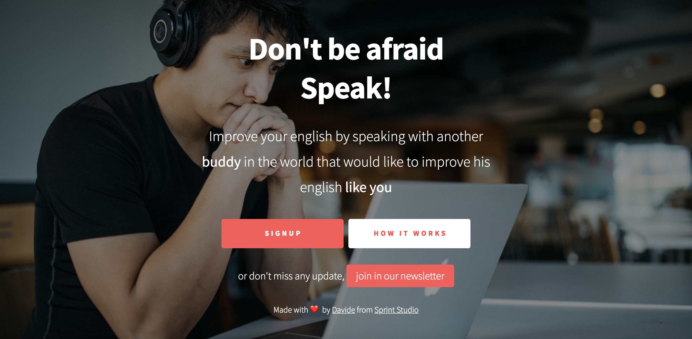
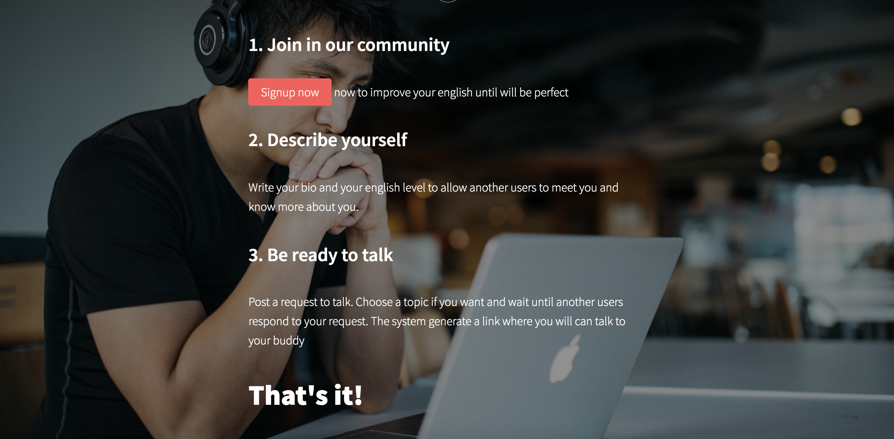
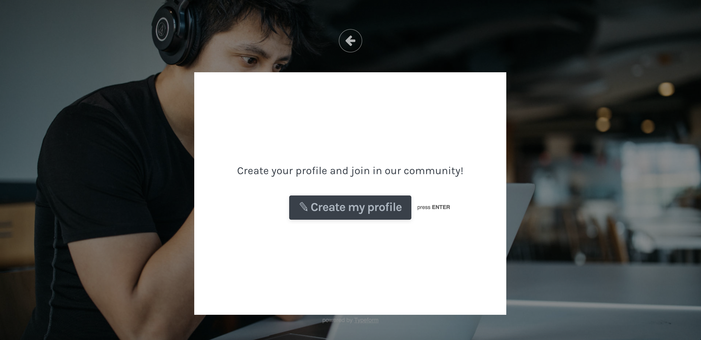

Qualche post fa, ho lanciato una sfida a me stesso: **[Sviluppare un side-project in pubblico](http://dailyminute.sprintstudio.co/journal/sviluppare-un-side-project-in-pubblico.html)** dal primo giorno, condividendo i progressi qui e su [Instagram](https://www.instagram.com/davidesicignani/). 

Se non sai di che progetto sto parlando, allora [leggi qui](http://dailyminute.sprintstudio.co/journal/side-project-1-migliorare-inglese.html) così potrai saperne di più. 

E' arrivato il momento di scrivere due update per farti sapere come sta andando (pensavo che la cosa morisse, invece no!). 

## Il nome
Attualmente la mia testa mi ha detto di chiamarlo **Taalk**, che poi non è così male, ma non so se manterrò il nome. 

Se hai idee su un possibile nome, scrivimi. 

## Il sito web
Per natura siamo portati a complicarci sempre la vita, ed io sono il primo, però questa volta ho deciso di mantenere le cose semplicisssssssime. 

Ho buttato giù un semplicissimo sito per presentare il servizio, sviluppato senza scrivere una riga di codice grazie a [Carrd](https://carrd.co/) ed integrando [Typeform](https://www.typeform.com/) per ricevere le iscrizioni degli utenti. 

 
<a class="btn" href="https://taalk.sprintstudio.co/" target="_blank">Clicca qui</a> per vedere il sito, mentre di seguito un paio di immagini 

### Home

### How it works

### Signup

**Fine!** 

## Diffusione
Come lo sto diffondendo? Come procede?
Ne parlerò in uno dei prossimi post 🤙🤙

Se ti vuoi iscrivere, allora clicca sul bottone qui sotto e crea il tuo profilo.

 
<a class="btn btn-block btn-shadow" href="https://taalk.sprintstudio.co/#signup" target="_blank">Crea il tuo profilo</a> 
 

Alla prossima!
